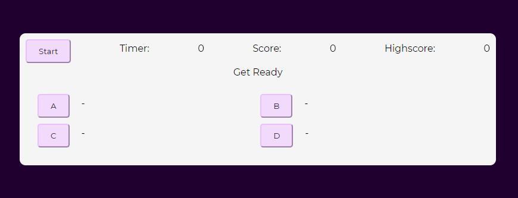
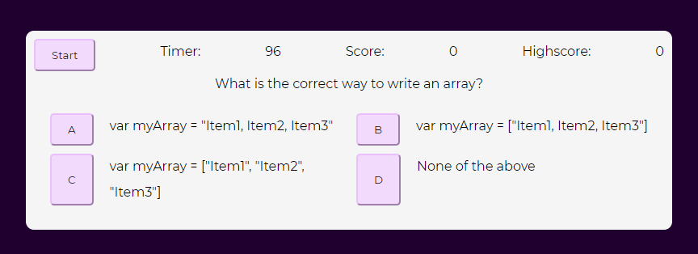
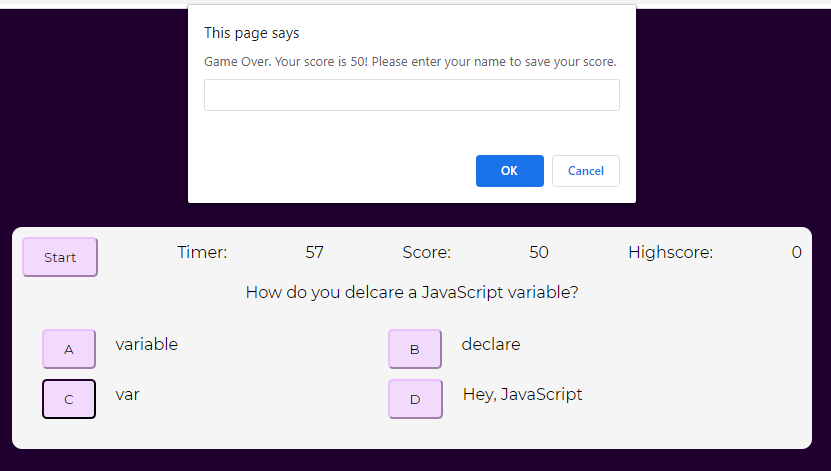
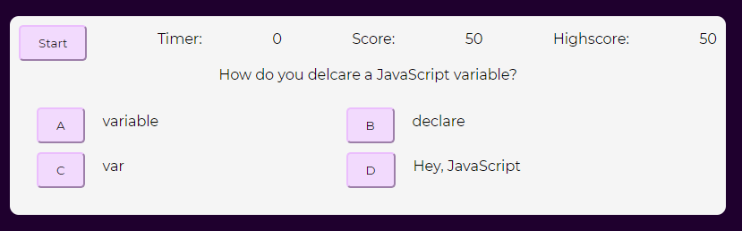

# Timed Quiz
> This is a timed quiz.

## Table of contents
* [General info](#general-info)
* [Screenshots](#screenshots)
* [Link](#link)
* [Status](#status)
* [Contribution](#contribution)

## General info
This project was built with HTML, CSS, and JavaScript.

## Screenshots
Landing page

Quiz start - timer begins and questions/answers generate

Prompt with score to wnter name at end of quiz

End quiz - timer at 0 and highscore saved

## Link
https://sharee-k.github.io/timed-quiz/

## Status
This project is finished for this training challenge.

## Contribution
Sharee Burkeen (https://github.com/sharee-k)